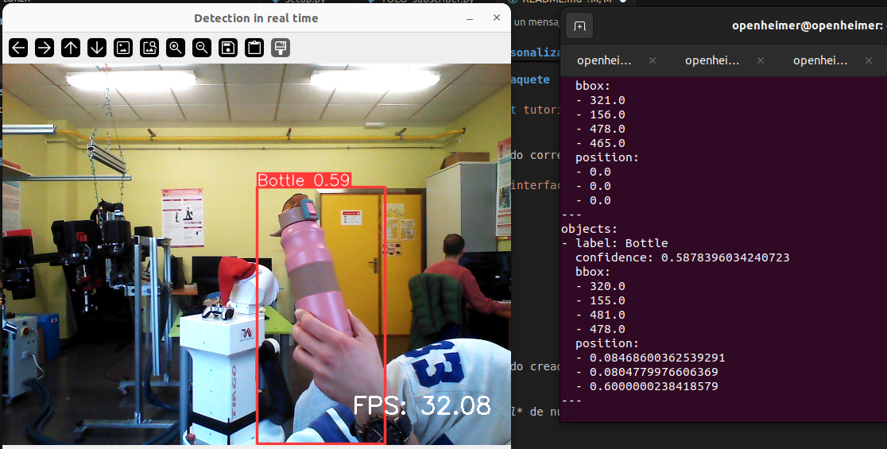

# ROS2
Repositorio para cargar un modelo entrenado de YOLO en un nodo de ROS2 utilizando la cámara Orbbec Astra.

## Nodo YOLO
Se ha creado un nodo desde cero para conectarse con los topic de la cámara. Para ello, se han seguido los siguientes pasos:
### 1. Crear paquete
Para crear un paquete tenemos que estar en el directorio de trabajo **/ros2_ws/src** previamente creado (https://docs.ros.org/en/humble/Tutorials/Beginner-Client-Libraries/Creating-A-Workspace/Creating-A-Workspace.html) y ejecutar desde terminal:
```bash
ros2 pkg create --build-type ament_python --license Apache-2.0 nombre_paquete
```
### 2. Crear nodo Subscriber
 Descargar ejemplo de nodo suscriptor de ROS2, dentro de la ruta **ros2_ws/src/nombre_paquete/nombre_paquete**:
```bash
wget https://raw.githubusercontent.com/ros2/examples/humble/rclpy/topics/minimal_subscriber/examples_rclpy_minimal_subscriber/subscriber_member_function.py
```
Nos encontraremos un archivo con el nombre ***susbcriber_member_function.py***, el cual podemos renombrar y editar su contenido. En nuestro caso, nos suscribimos a dos topics de la cámara Orbbec Astra, tales como **/camera/color/image_raw** y **/camera/depth/image_raw**, los cuales nos permiten visulaizar las imágenes de la cámara y su profundidad. Una vez suscrito, podemos cargar nuestro modelo YOLO entrenado y pasarle cada imagen de la cámara para que lance el programa y detecte el objeto que queramos. Además, se recoge información sobre la clase, confianza y coordenada 3D de cada objeto detectado en otro topic creado llamado **/detected_objects**, el cual se explicará más adelante.

### 3. Añadir dependencias
En la ruta **ros2_ws/scr/nombre_paquete**, se encuentran los archivos creados previamente para nosotros: ***setup.py, setup.cfg y package.xml***
Dentro de `*package.xml* debemos completar las tags y añadir las siguientes dependencias que el paquete necesita cuando ejecuta el nodo:
```bash
<exec_depend>rclpy</exec_depend>
<exec_depend>std_msgs</exec_depend>
```

### 4. Añadir puntos de entrada
En el archivo *setup.py* debemos completar las tags para que coincidan con las de *package.xml* y añadir la siguiente línea:
```bash
entry_points={
        'console_scripts': [
                'listener = py_pubsub.subscriber_member_function:main',
        ],
},
```
Revisar el archivo *setup.cfg*, que debería tener este aspecto:
```bash
[develop]
script_dir=$base/lib/py_pubsub
[install]
install_scripts=$base/lib/py_pubsub
```

### 5. Construir y compilar
Retrocedemos a la ruta **/ros_ws** y ejecutamos *rosdep* para revisar si nos falta alguna dependencia.
```bash
rosdep install -i --from-path src --rosdistro humble -y
```
Para construir el paquete ejecutamos:
```bash
colcon build --packages-select nombre_paquete
```
Para compilar el paquete:
```bash
source install/setup.bash
```

Ahora podemos lanzar el nodo de Yolo:
```bash
ros2 run nombre_paquete YOLO_subscriber
```

## Creación de un mensaje personalizado
Como hemos comentado antes, aparte de crear un nodo que se suscribe a dos topics de la cámara, también se creó un nurvo topic al que le pasamos la información que nos interesa, en nuestro caso; la clase del objeto detectado, la confianza con la que podemos asegurar que se trata de un objeto de dicha clase y las coordenadas 3d del objeto. Para ello, seguimos los siguientes pasos:
https://docs.ros.org/en/humble/Tutorials/Beginner-Client-Libraries/Custom-ROS2-Interfaces.html

### 1. Crear paquete
Crearemos un paquete personalizado con el archivo *.msg* que queremos, de la misma forma que hemos visto anteriormente(desde **ros_ws/src**):
```bash
ros2 pkg create --build-type ament_cmake --license Apache-2.0 interfaces
```    
Hay que tener en cuenta que se trata de un paquete CMake pero se puede usar con nodos en Python o C++ indistintamente.
Los archivos .msg deben estar en una carpeta llamada *msg*, la cual la crearemos en el directorio **ros_ws/src/interfaces**:
```bash
mkdir msg 
```

### 2. Definir mensaje
En el directorio **interfaces/msg** creamos un archivo *DetectedObject.msg* declarando la estrucutura de los datos que queremos recoger. En nuestro caso:
```bash
string label      # Etiqueta del objeto (e.g., "persona", "coche")
float32 confidence # Confianza del modelo para esta detección
float32[] bbox    # Bounding box: [xmin, ymin, xmax, ymax]
float32[] position # Coordenadas 3D: [x, y, z]
```

Además, creamos otro archivo (*DetectedObjects.msg*) que será un array de objetos, es decir, un array con los datos del archivo anterior:
```bash
DetectedObject[] objects  
```

### 3. CmakeList.txt y package.xml
Añadir las siguientes líneas al *CmakeList.txt*:
```bash
find_package(rosidl_default_generators REQUIRED)

rosidl_generate_interfaces(${PROJECT_NAME}
  "msg/Detectedobject.msg"
  "msg/Detectedobjets.msg"
)
```
Y a *package.xml*:
```bash
<buildtool_depend>rosidl_default_generators</buildtool_depend>
<exec_depend>rosidl_default_runtime</exec_depend>
<member_of_group>rosidl_interface_packages</member_of_group>
```

### 4. Construir y compilar paquete
```bash
colcon build --packages-select interfaces
source install/setup.bash
```
Para confirmar que se ha creado correctamente:
```bash
ros2 interface show interfaces/msg/DetectedObjects
```
Nos debería devolver:
```bash
DetectedObject[] objects
        string label      
        float32 confidence 
        float32[] bbox    
        float32[] position 
```

### 5. Integrar en nodo YOLO
Por último, modificando el nodo creado anteriormente, podemos crear un Publisher que muestre los mensajes definidos en un topic al cual podemos suscribirnos.

Debemos añadir al *package.xml* de nuestro paquete principal (el del nodo de YOLO), la siguiente línea que indica la conexión con el paquete de nuestro mensaje personalizado:
```bash
<exec_depend>interfaces</exec_depend>
```
Por último, construimos y compilamos de nuevo y podemos lanzar nuestro nodo de YOLO.

